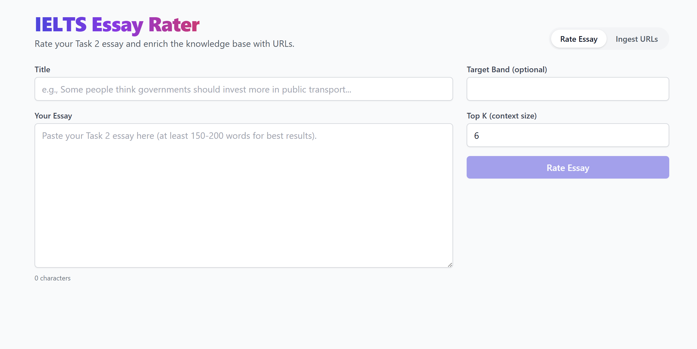
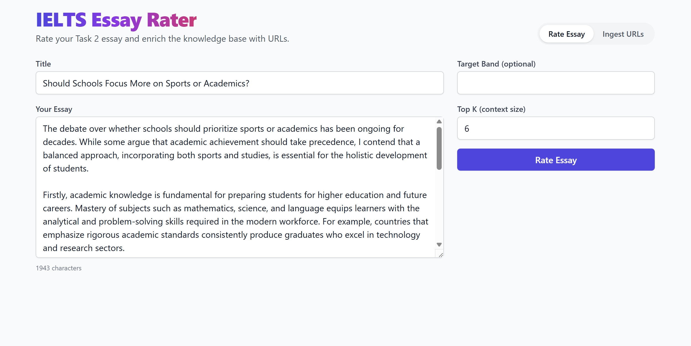
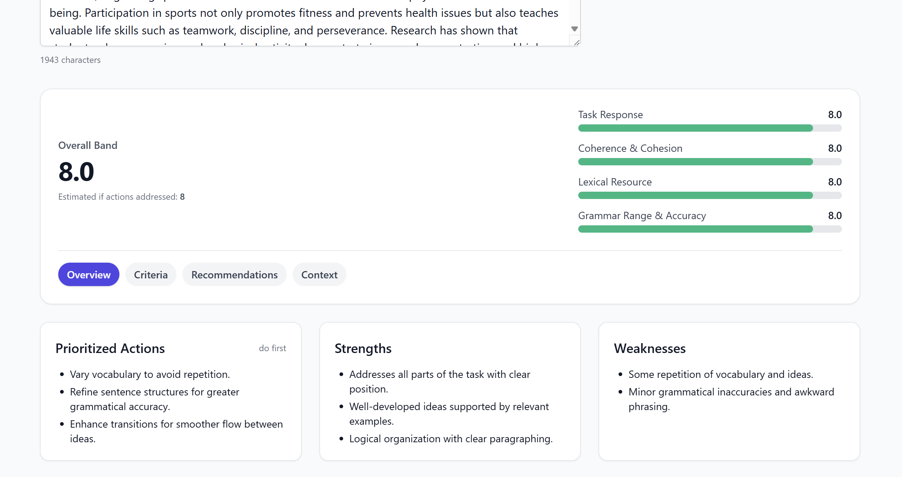
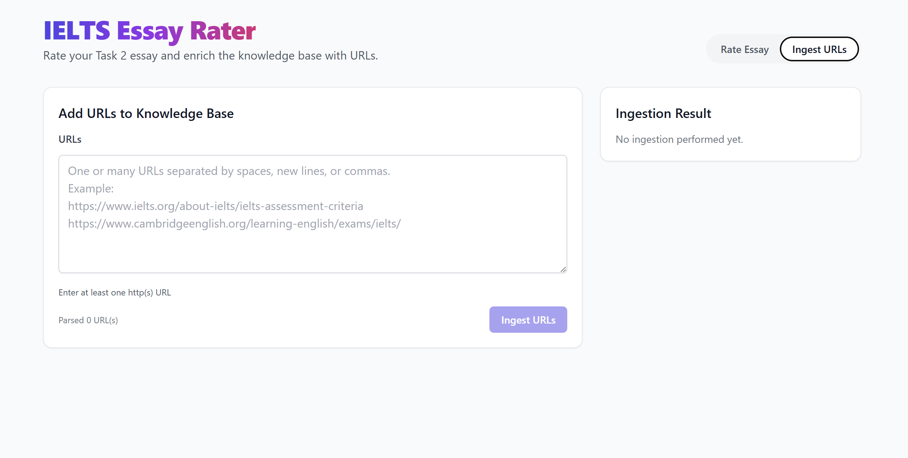

# IELTS Essay Rater & Recommender

FastAPI + LangChain RAG backend and a React (Vite + Tailwind) frontend to rate IELTS Task 2 essays, provide structured feedback, and generate improved versions.

## Screenshots








## Features
- Rate essays with structured IELTS band scores (Task Response, Coherence & Cohesion, Lexical Resource, Grammar Range & Accuracy, Overall)
- Actionable strengths, weaknesses, prioritized actions, and estimated band if addressed
- Recommendations: improved essay, bullet suggestions, high‑value patterns
- Retrieval-Augmented Generation (RAG) over PDFs and web sources (Chroma persistence)
- Ingest new URLs from the UI (or API) to enrich the knowledge base

## Repository Structure
```
ielts-essay-rate/
  backend/
    app.py
    config.py
    chains/
    models/
    prompts/
    scripts/
    utils/
    data/
  frontend/
    index.html
    vite.config.ts
    src/
      App.tsx
      pages/HomePage.tsx
      components/
      lib/
      types/
```

## Quick Start

### 1) Backend
- Requirements: Python 3.10+
- Copy env file and set keys:
  - Create `backend/.env` from `.env.example` if present, or set environment variables directly.
  - Recommended: set `OPENAI_API_KEY` and (optionally) `USER_AGENT`.
- Install dependencies:
```cmd
cd backend
pip install -r requirements.txt
```
- Ingest sources (optional URLs; PDFs go in `backend/data/sources/`):
```cmd
# Ingest PDFs found under backend/data/sources
python scripts\ingest.py

# Ingest specific URLs
python scripts\ingest.py https://www.ielts.org/about-ielts/ielts-assessment-criteria

# Ingest only the provided URLs (skip PDFs)
python scripts\ingest.py --skip-pdf https://example.com/a https://example.com/b
```
- Run the API server:
```cmd
uvicorn app:app --reload --host 0.0.0.0 --port 8000
```
- Swagger UI: http://localhost:8000/docs

Key endpoints:
- GET `/health`
- POST `/ingest` body `{ "urls": ["https://..."] }`
- POST `/rate` body:
```json
{
  "title": "Some people think...",
  "essay_text": "Your essay here...",
  "target_band": 7.0,
  "top_k": 6
}
```

Notes:
- Chroma 0.4+ auto‑persists; no manual persist() needed.
- If you see site blocks, set a desktop `USER_AGENT` in `backend/.env`.

### 2) Frontend
- Requirements: Node 18+
- Configure API base (optional): create `frontend/.env` with `VITE_API_BASE=http://localhost:8000`
- Install and run:
```cmd
cd ..\frontend
npm install
npm run dev
```
- Open http://localhost:5173

UI tips:
- Top tabs: “Rate Essay” and “Ingest URLs”
- Results tabs: Overview, Criteria, Recommendations, Context

## Configuration
Environment variables (backend):
- `OPENAI_API_KEY` (required)
- `MODEL` (default: gpt-4.1-nano; set per your access)
- `EMBEDDING_MODEL` (default set in code: text-embedding-ada-002)
- `VECTORSTORE_DIR` (default: data/vectorstore)
- `DATA_SOURCES_DIR` (default: data/sources)
- `USER_AGENT` (recommended: desktop UA string)
- LangSmith (optional): `LANGSMITH_TRACING`, `LANGSMITH_API_KEY`, `LANGCHAIN_PROJECT`

## Development
- Backend stack: FastAPI, LangChain, Chroma, OpenAI, Pydantic
- Frontend stack: React + Vite, TailwindCSS, axios
- Code split: 
  - Frontend components under `src/components`, shared types under `src/types`, API helper under `src/lib`.
  - Backend chains under `backend/chains`, helpers under `backend/utils`.

## Troubleshooting
- Deprecation: If you saw a Chroma persist warning, it’s already fixed (auto‑persist).
- 401 with LangSmith: disable tracing or set proper env.
- Blocked web loads: set `USER_AGENT` in backend .env.

## License
MIT
